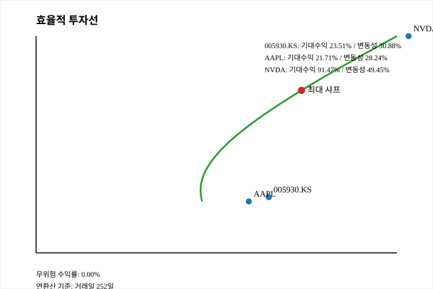

# temp.csv 데이터 분석

## 데이터 개요
- 원본 파일: `temp.csv`
- 구조: 3중 헤더(`Price/High/Low/Open/Volume` → 티커 → 데이터 타입)로 구성된 일별 시세 데이터
- 추출된 티커: 삼성전자(005930.KS), 애플(AAPL), 엔비디아(NVDA)
- 관측치: 총 516일치 레코드 (티커별 거래일은 공휴일 등에 따라 상이)

## 기간 요약
| 티커 | 관측 거래일 수 | 시작일 | 종료일 |
| --- | ---: | --- | --- |
| 005930.KS | 482 | 2023-10-16 | 2025-10-10 |
| AAPL | 499 | 2023-10-16 | 2025-10-10 |
| NVDA | 499 | 2023-10-16 | 2025-10-10 |

## 종가 통계
| 티커 | 최신 종가 | 평균 ± 표준편차 | 최저 | 최고 |
| --- | ---: | ---: | ---: | ---: |
| 005930.KS | 94,400.00 | 66,471.53 ± 9,708.84 | 48,968.97 | 94,400.00 |
| AAPL | 245.27 | 209.52 ± 24.38 | 163.82 | 258.10 |
| NVDA | 183.16 | 115.60 ± 39.00 | 40.30 | 192.57 |

- 삼성전자 종가는 기간 말에 사상 최고치(94,400원)를 기록하며 평균 대비 +41% 상승.
- 애플은 평균 209.5달러 수준에서 안정적인 박스권을 형성.
- 엔비디아는 저가 40.30달러에서 최고 192.57달러까지 폭넓은 변동성을 보임.

## 거래량 통계 (백만 주)
| 티커 | 평균 | 표준편차 | 최저 | 최고 |
| --- | ---: | ---: | ---: | ---: |
| 005930.KS | 19.48 | 8.62 | 2.96 | 57.69 |
| AAPL | 56.56 | 26.92 | 23.23 | 318.68 |
| NVDA | 325.12 | 156.34 | 105.16 | 1,142.27 |

- 애플 대비 엔비디아의 일평균 거래량은 약 5.7배로, 시장 참여도가 매우 높음.
- 삼성전자는 2024년 이후 거래량이 점진적으로 증가하며 최대 5,769만주까지 관측됨.

## 일간 수익률(%) 통계
| 티커 | 평균 | 표준편차 | 최저 | 최고 |
| --- | ---: | ---: | ---: | ---: |
| 005930.KS | 0.10 | 1.93 | -10.30 | 7.21 |
| AAPL | 0.08 | 1.77 | -9.25 | 15.33 |
| NVDA | 0.33 | 3.21 | -16.97 | 18.72 |

- 엔비디아는 평균 수익률이 가장 높지만 변동성(표준편차 3.21%) 또한 최대.
- 세 종목 모두 -9% 이상의 급락 구간이 존재하여 리스크 관리 필요성을 시사.

## 분석 재현 방법
Python 표준 라이브러리만으로 결과를 재현할 수 있습니다.

```bash
python scripts/summarize_temp.py --csv temp.csv
python scripts/efficient_frontier.py --csv temp.csv --output assets/efficient_frontier.svg
```

`--csv` 인자는 다른 경로나 파일 이름을 사용할 때 지정하면 됩니다. 효율적 투자선 스크립트는 추가로 연환산 일수(`--trading-days`, 기본 252), 위험 자유 수익률(`--risk-free`, 기본 0.0)과 SVG 출력 경로(`--output`)를 커스터마이징할 수 있습니다.

### `scripts/summarize_temp.py`
```python
import argparse
from pathlib import Path
from csv import reader
from datetime import datetime
from math import sqrt


def stats(values):
    n = len(values)
    avg = sum(values) / n
    var = sum((v - avg) ** 2 for v in values) / (n - 1) if n > 1 else 0.0
    return avg, sqrt(var)


def parse_args() -> argparse.Namespace:
    parser = argparse.ArgumentParser(description="Summarise temp.csv time series metrics")
    parser.add_argument("--csv", type=Path, default=Path("temp.csv"), help="Input CSV path")
    return parser.parse_args()


def main():
    args = parse_args()

    with args.csv.open() as f:
        csv_reader = reader(f)
        header1, header2, header3 = [next(csv_reader) for _ in range(3)]
        rows = list(csv_reader)

    metrics = ["Close", "High", "Low", "Open", "Volume"]
    indices = {metric: {} for metric in metrics}
    for idx, (metric_name, ticker) in enumerate(zip(header1[1:], header2[1:]), start=1):
        if metric_name in metrics:
            indices[metric_name][ticker] = idx

    series = {}
    for row in rows:
        date = datetime.strptime(row[0], "%Y-%m-%d").date()
        for metric in metrics:
            for ticker, col in indices[metric].items():
                value = row[col]
                if value:
                    series.setdefault(ticker, {}).setdefault(metric, []).append((date, float(value)))

    for ticker, metric_data in series.items():
        closes = sorted(metric_data["Close"])
        volumes = sorted(metric_data["Volume"])
        returns = [
            (curr - prev) / prev * 100
            for (_, prev), (_, curr) in zip(closes, closes[1:])
            if prev
        ]

        close_vals = [v for _, v in closes]
        volume_vals = [v for _, v in volumes]

        close_avg, close_std = stats(close_vals)
        volume_avg, volume_std = stats(volume_vals)
        return_avg, return_std = stats(returns)

        print(f"{ticker} | {len(close_vals)} days | {closes[0][0]} - {closes[-1][0]}")
        print(
            "  Close: "
            f"last={close_vals[-1]:.2f}, "
            f"mean={close_avg:.2f}±{close_std:.2f}, "
            f"min={min(close_vals):.2f}, max={max(close_vals):.2f}"
        )
        print(
            "  Volume: "
            f"mean={volume_avg/1e6:.2f}M±{volume_std/1e6:.2f}M, "
            f"min={min(volume_vals)/1e6:.2f}M, max={max(volume_vals)/1e6:.2f}M"
        )
        print(
            "  Return: "
            f"mean={return_avg:.2f}%, std={return_std:.2f}%, "
            f"min={min(returns):.2f}%, max={max(returns):.2f}%\n"
        )


if __name__ == "__main__":
    main()
```

> `scripts/summarize_temp.py`는 README에 제시된 통계를 그대로 출력하며, 추가 라이브러리 설치가 필요하지 않습니다.

## 효율적 투자선(Efficient Frontier) 분석
- 3개 종목의 일간 수익률을 동일 거래일 기준으로 정렬한 뒤, 사용자 지정 연환산 일수(기본 252일)에 맞춰 기대수익률과 변동성을 연환산했습니다.
- 전통적인 평균-분산 최적화 공식을 사용하여 목표 수익률 구간(최소~최대) 전반의 효율적 투자선을 추정했습니다.
- 위험 자유 수익률을 0%로 둔 경우 최대 샤프 조합은 연환산 기대수익률 68.58%, 변동성 35.24%로, 엔비디아 66.3%, 삼성전자 35.8%, 애플 -2.0%(소폭 공매도) 비중을 제시합니다.


